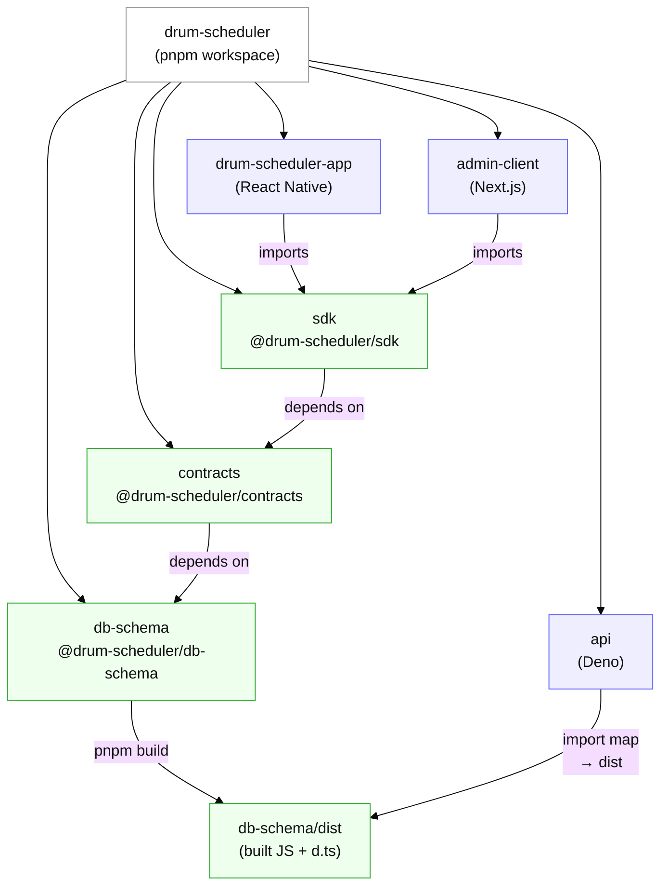

# Monorepo diagram

Notes:
- `pnpm` links workspace packages into each app’s `node_modules` when the app declares them as dependencies (e.g. React Native app depends on `@drum-scheduler/sdk`).
- The Deno API does not use `workspace:` deps directly; it consumes the built output from `packages/db-schema/dist` via `apps/api/deno.json` import map.
